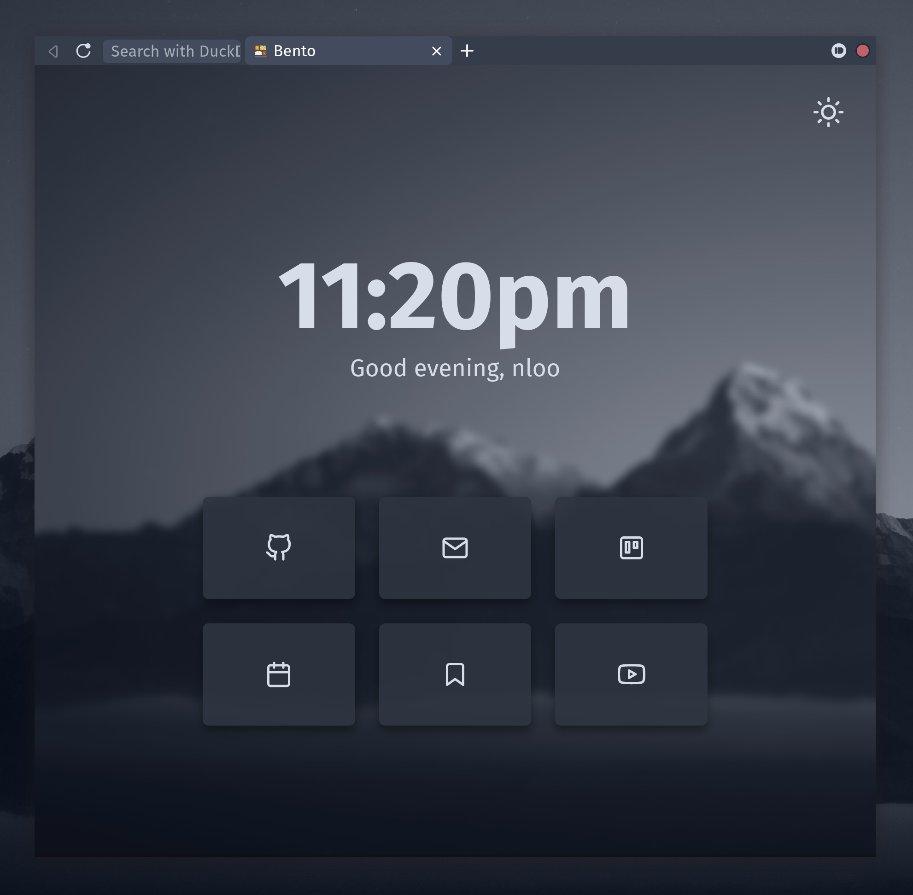

# nlooFirefoxCSS-nord
My Firefox css mods but with some updates and a nord theme.

The base theme is from https://github.com/migueravila/SimplerentFox with some mods I added to it. 

You can change the wallpaper if you want for the new tab by changing the .png. 

To add this to your Firefox:
- First enable custom CSS on Firefox
- Take the `./chrome` folder on this repo and put it in your profile folder (something like `c/USER/AppData/Roaming/Mozilla/Firefox/Profiles/[xxxxx].default-release/)`
- I use [this theme](https://addons.mozilla.org/en-US/firefox/addon/nord-theme-cool/?utm_content=addons-manager-reviews-link&utm_medium=firefox-browser&utm_source=firefox-browser) (not requried tho) 
- I recommend 'default' density for firefox

Preview:

